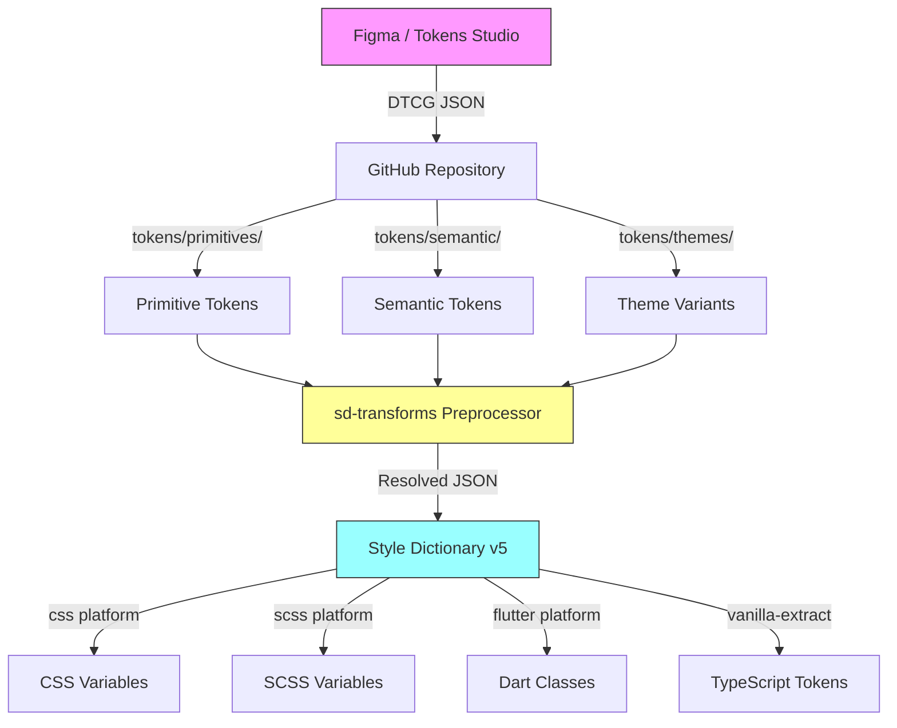

# The Definitive Guide: Syncing Design Tokens from Figma to Code (2025 Edition)

## 📋 Overview

### What You'll Learn

By the end of this guide, you will be able to:

- Structure a scalable **multi-theme token architecture** using the Primitives → Semantic → Component hierarchy
- Configure **Tokens Studio for Figma** with W3C DTCG format and Git synchronization
- Set up **Style Dictionary v5** with **@tokens-studio/sd-transforms** for multi-platform builds
- Generate production-ready output for **CSS**, **SCSS**, **Flutter (Dart)**, and **Vanilla Extract**
- Automate the entire pipeline with **GitHub Actions** (2025 action versions)
- Implement **light/dark theming** and **multi-brand** token switching
- Debug common pipeline failures independently

### Who This Guide Is For

| Audience | Fit Level | Notes |
|----------|-----------|-------|
| Design Systems Engineers | ⭐⭐⭐⭐⭐ | Primary audience - full implementation |
| Front-End Developers | ⭐⭐⭐⭐⭐ | CSS/SCSS/Vanilla Extract focus |
| Flutter Developers | ⭐⭐⭐⭐ | Dart output + ThemeExtension patterns |
| Technical Designers | ⭐⭐⭐ | Focus on Phases 1-3 (Figma side) |
| Product Designers | ⭐⭐ | Phase 3 only (Token Studio setup) |

### Prerequisites

**Required Knowledge:**
- [ ] Basic command line navigation (cd, ls, mkdir)
- [ ] Git fundamentals (clone, commit, push, pull)
- [ ] JSON syntax (can read/write JSON files)
- [ ] Basic understanding of CSS custom properties

**Required Tools:**
- [ ] **Node.js v22+** installed (`node -v` should return v22.x or higher)
- [ ] **pnpm** (recommended) or npm (`pnpm -v` or `npm -v`)
- [ ] Git installed (`git --version`)
- [ ] VS Code or any code editor
- [ ] Figma account (free tier works for learning)
- [ ] GitHub account

**Nice to Have (Not Required):**
- Experience with SCSS/Sass
- Familiarity with Flutter/Dart
- Previous exposure to CSS-in-JS (Vanilla Extract)
- Understanding of CI/CD concepts

### Time Investment

| Phase | Time | Difficulty | Key Outcome |
|-------|------|------------|-------------|
| Phase 1: Foundation & Architecture | 20-25 min | 🟢 Beginner | Project structure + token hierarchy understanding |
| Phase 2: Token Definition (Figma) | 25-30 min | 🟢 Beginner | Tokens Studio configured with DTCG format |
| Phase 3: Build Pipeline Setup | 30-40 min | 🟡 Intermediate | Style Dictionary v5 + sd-transforms working |
| Phase 4: Multi-Platform Output | 25-30 min | 🟡 Intermediate | CSS, SCSS, Flutter, Vanilla Extract outputs |
| Phase 5: Multi-Theme Architecture | 30-35 min | 🟠 Advanced | Light/dark + brand theming |
| Phase 6: CI/CD Automation | 20-25 min | 🟡 Intermediate | GitHub Actions pipeline |
| Hands-On Project | 15-20 min | 🟡 Intermediate | Full round-trip verification |
| **Total** | **2.5-3.5 hours** | | |

**Completion Style:** Best completed in 2-3 sessions:
- Session 1: Phases 1-3 (Foundation through build pipeline)
- Session 2: Phases 4-5 (Platform outputs and theming)
- Session 3: Phase 6 + Hands-On Project (Automation and verification)

---

## 🎯 Why This Matters

### The Problem

Design systems face a fundamental synchronization challenge:

```
Designer (Figma): "Primary blue is #0066FF"
Web Developer: "I have --color-primary: #0066EE in CSS"
Flutter Developer: "My Color(0xFF0055FF) seems different"
Six months later: "Which one is actually correct?"
```

This is **design drift**-where design files and production code diverge until consistency becomes impossible. The consequences compound across platforms:

| Problem | Web Impact | Mobile Impact | Business Impact |
|---------|------------|---------------|-----------------|
| Manual sync | Copy-paste errors | Hardcoded values | Inconsistent UX |
| No versioning | "Which CSS is latest?" | Out-of-sync releases | Brand damage |
| Platform silos | CSS ≠ SCSS ≠ Dart | Different interpretations | Slower development |
| Theme changes | Find-replace nightmare | Rebuild themes manually | Delayed launches |

### The Solution

A **Continuous Integration pipeline** with three key principles:

1. **Single Source of Truth**: Figma (via Tokens Studio) defines all design decisions
2. **Automated Transformation**: Style Dictionary converts tokens to any platform format
3. **Git-Based Workflow**: Version control tracks every change with full history

```
┌─────────────────────────────────────────────────────────────────────────┐
│                        THE TOKEN PIPELINE                                │
├─────────────────────────────────────────────────────────────────────────┤
│                                                                         │
│  FIGMA                    GITHUB                      YOUR APPS         │
│  ┌─────────────┐         ┌─────────────┐            ┌─────────────┐    │
│  │   Tokens    │  push   │   tokens/   │   build    │    CSS      │    │
│  │   Studio    │ ──────► │  (DTCG JSON)│ ────────►  │    SCSS     │    │
│  │   (DTCG)    │         │             │            │    Dart     │    │
│  └─────────────┘         │  GitHub     │            │    VE       │    │
│                          │  Actions    │            └─────────────┘    │
│                          └─────────────┘                               │
│                                                                         │
└─────────────────────────────────────────────────────────────────────────┘
```

### Benefits

| Benefit | What It Means | Real-World Impact |
|---------|---------------|-------------------|
| **Single Source of Truth** | One canonical location for every value | Eliminates "which is correct?" debates |
| **Multi-Platform Consistency** | One decision → CSS, SCSS, Dart, TypeScript | Perfect cross-platform parity |
| **Theme Scalability** | Add light/dark/brand themes without rewrites | 10x faster theme rollouts |
| **Type Safety** | TypeScript/Dart types generated automatically | Catch errors at compile time |
| **Version Control** | Git history tracks every change | Know who changed what, when, why |
| **Automation** | No manual handoff documents | Zero copy-paste errors |

### Trade-offs & Alternatives

> 💡 **The "So What?" Test**: Why choose THIS stack over alternatives?

**What You Gain:**
- W3C standardized format (future-proof)
- Maximum platform flexibility (4+ outputs)
- Proven patterns from Adobe, GitHub, Shopify
- Type-safe outputs with full IDE support

**What You Trade:**
- Initial setup complexity (~3 hours)
- Learning curve for DTCG format
- Node.js 22+ requirement (Style Dictionary v5)
- Tokens Studio Pro recommended for multi-file sync

**Alternative Approaches:**

| Approach | Pros | Cons | When to Use |
|----------|------|------|-------------|
| **This Guide (Tokens Studio + SD v5)** | Full automation, multi-platform, W3C standard | Setup complexity | Teams building for web + mobile |
| **Terrazzo (Cobalt UI)** | DTCG-native, simpler config | Fewer output formats, newer ecosystem | DTCG purists, simpler needs |
| **Figma Variables Only** | Built-in, no plugins | No DTCG, limited types, no Flutter | Figma-only, web-only teams |
| **Manual Export** | Zero setup | Error-prone, no automation | Solo prototypes only |

**Decision Framework:**
```
Do you need multiple platforms (web + mobile)?
├── No → Figma Variables may suffice
└── Yes → Do you need multi-theming?
    ├── No → Simpler token structure possible
    └── Yes → This guide is for you ✓
```

---

## 🧠 Core Concepts (Foundation)

> ⚠️ **Critical Section**: Understanding these concepts prevents 80% of debugging headaches. Do not skip.

### Concept 1: The W3C DTCG Format

**What It Is:**
The **Design Tokens Community Group (DTCG)** specification (v2025.10) is the W3C standard for design token interchange. It uses `$`-prefixed properties for token metadata.

**Legacy Format (Pre-2024):**
```json
{
  "color": {
    "primary": {
      "value": "#0066FF",
      "type": "color"
    }
  }
}
```

**DTCG Format (2025 Standard):**
```json
{
  "color": {
    "primary": {
      "$value": "#0066FF",
      "$type": "color",
      "$description": "Primary brand color for CTAs"
    }
  }
}
```

**Why It Matters:**
- **Standardization**: Adobe, Google, Microsoft, Figma all support DTCG
- **Tool Interoperability**: Any DTCG-compliant tool can read your tokens
- **Future-Proof**: The W3C standard won't be deprecated like proprietary formats
- **Rich Metadata**: `$description`, `$extensions` enable documentation and tooling

**Key DTCG Rules:**
1. Properties starting with `$` are **reserved** for specification use
2. `$value` is required for every token (the actual value)
3. `$type` can be inherited from parent groups
4. References use `{path.to.token}` syntax

### Concept 2: The Three-Tier Token Hierarchy

**What It Is:**
A scalable architecture separating tokens into **Primitives**, **Semantic**, and **Component** tiers.

```
┌─────────────────────────────────────────────────────────────────┐
│                     TOKEN HIERARCHY                              │
├─────────────────────────────────────────────────────────────────┤
│                                                                 │
│  TIER 3: COMPONENT TOKENS (Optional)                            │
│  ┌─────────────────────────────────────────────────────────┐   │
│  │  button.primary.background = {color.action.primary}      │   │
│  │  card.border.radius = {radius.md}                        │   │
│  └─────────────────────────────────────────────────────────┘   │
│                           │                                     │
│                           ▼                                     │
│  TIER 2: SEMANTIC TOKENS (Public API)                           │
│  ┌─────────────────────────────────────────────────────────┐   │
│  │  color.action.primary = {color.primitive.blue.500}       │   │
│  │  color.background.default = {color.primitive.gray.100}   │   │
│  │  radius.md = {radius.primitive.8}                        │   │
│  └─────────────────────────────────────────────────────────┘   │
│                           │                                     │
│                           ▼                                     │
│  TIER 1: PRIMITIVE TOKENS (Raw Values)                          │
│  ┌─────────────────────────────────────────────────────────┐   │
│  │  color.primitive.blue.500 = #0066FF                      │   │
│  │  color.primitive.gray.100 = #F8F9FA                      │   │
│  │  radius.primitive.8 = 8px                                │   │
│  └─────────────────────────────────────────────────────────┘   │
│                                                                 │
└─────────────────────────────────────────────────────────────────┘
```

**Why It Matters:**

| Tier | Purpose | Visibility | Changes |
|------|---------|------------|---------|
| **Primitives** | Raw design values (palette, scale) | Internal only | Rarely change |
| **Semantic** | Design intent (action, background) | Public API | Change for themes |
| **Component** | UI-specific mappings | Component-scoped | Change per component |

**Real-World Analogy:**
Think of cooking:
- **Primitives** = Ingredients (flour, sugar, eggs)
- **Semantic** = Recipe categories (dry ingredients, wet ingredients)
- **Component** = Specific dishes (chocolate cake uses semantic mappings)

**When to Use Each Tier:**
- **Start with 2 tiers** (Primitives + Semantic) - this covers 90% of needs
- **Add Component tier** only when you have 50+ components with unique token needs
- **Never expose Primitives** directly to consumers - always go through Semantic

### Concept 3: Theme Switching via Semantic Aliasing

**What It Is:**
Themes work by keeping the **Semantic token names identical** but pointing to **different Primitive values**.

**Light Theme:**
```json
{
  "color": {
    "background": { "$value": "{color.primitive.white}" },
    "foreground": { "$value": "{color.primitive.gray.900}" }
  }
}
```

**Dark Theme:**
```json
{
  "color": {
    "background": { "$value": "{color.primitive.gray.900}" },
    "foreground": { "$value": "{color.primitive.white}" }
  }
}
```

**Why It Matters:**
- **Same API, different values**: `color.background` works in any theme
- **No code changes**: Switch themes by swapping token files
- **Scalable**: Add new themes (high contrast, brand variants) without touching components

### Concept 4: sd-transforms (The Bridge)

**What It Is:**
`@tokens-studio/sd-transforms` is a Style Dictionary preprocessor that handles Tokens Studio-specific features.

**What It Does:**
1. Resolves **math expressions** (`{spacing.base} * 2` → `32px`)
2. Processes **color modifiers** (`rgba({color.primary}, 0.5)`)
3. Expands **composite tokens** (typography → individual properties)
4. Handles **DTCG format** conversion

**Why It Matters:**
Tokens Studio outputs JSON with features Style Dictionary can't natively understand. sd-transforms bridges this gap.

```
Tokens Studio JSON  →  sd-transforms  →  Style Dictionary  →  Platform Output
   (rich features)       (preprocessing)    (transformation)     (CSS/Dart/etc)
```

### How These Concepts Connect



### ✅ Concept Checkpoint

Before proceeding, verify you understand:

- [ ] **DTCG Format**: What does `$value` signify vs `value`?
- [ ] **Three Tiers**: Which tier should developers consume directly?
- [ ] **Theme Switching**: How do light/dark themes use the same token names?
- [ ] **sd-transforms**: Why can't Style Dictionary process Tokens Studio JSON directly?

> 💡 **Stuck?** Re-read the section above. These concepts are foundational-rushing past them creates confusion in every subsequent phase.

---

## 📦 Complete Token Catalog (Material Design 3)

This repository implements a **production-grade, comprehensive token system** based on Material Design 3 specifications.

### Token Category Matrix

| Category | Primitive Count | Semantic Count | Total Tokens | MD3 Alignment | Status |
|----------|----------------|----------------|--------------|---------------|--------|
| **Colors** | 95 tokens | 60 tokens | 155 | ✅ Tonal palettes, surfaces, state layers | Complete |
| **Spacing** | 20 tokens | 35 tokens | 55 | ✅ 4dp grid system | Complete |
| **Typography** | 40 tokens | 45 tokens | 85 | ✅ Type scale (display/headline/title/body/label) | Complete |
| **Border Radius** | 9 tokens | 11 tokens | 20 | ✅ Shape system | Complete |
| **Shadows** | 6 tokens | 12 tokens | 18 | ✅ Elevation levels 0-5 | Complete |
| **Borders** | 5 tokens | 5 tokens | 10 | ✅ Outline variants | Complete |
| **Motion** | 24 tokens | 15 tokens | 39 | ✅ Duration + easing (standard/emphasized) | Complete |
| **Opacity** | 12 tokens | 5 tokens | 17 | ✅ State layers (hover/focus/disabled) | Complete |
| **Z-Index** | 9 tokens | 8 tokens | 17 | 🔹 Extended | Complete |
| **Breakpoints** | 6 tokens | - | 6 | ✅ Responsive (compact/medium/expanded) | Complete |
| **Icons** | 7 tokens | - | 7 | 🔹 Extended | Complete |
| **TOTAL** | **233 tokens** | **196 tokens** | **429 tokens** | | **✅ Production-Ready** |

### What's Included

#### 🎨 **Colors (155 tokens)**

**Primitives (95):**
- Primary palette: 50-900 (10 shades) - Material Design 3 blue
- Secondary palette: 50-900 (10 shades) - Material Design 3 pink
- Tertiary palette: 50-900 (10 shades) - Material Design 3 teal
- Neutral: 0, 10, 20, 30, 40, 50, 60, 70, 80, 90, 95, 99, 100 (13 tones)
- Neutral-variant: 0-100 (13 tones)
- Error: 50-900 (10 shades)
- Warning: 50-900 (10 shades)
- Success: 50-900 (10 shades)
- Info: 50-900 (10 shades)
- White, Black

**Semantics (60):**
- Surface: default, variant, dim, bright, container-lowest/low/default/high/highest (9)
- On-surface: default, variant (2)
- Primary: default, container, on-primary, on-container, hover, focus, active, disabled (8)
- Secondary: default, container, on-secondary, on-container, hover, focus, active (7)
- Tertiary: default, container, on-tertiary, on-container, hover (5)
- Error: default, container, on-error, on-container, hover, focus (6)
- Warning: default, container, on-warning, on-container, hover (5)
- Success: default, container, on-success, on-container, hover (5)
- Info: default, container, on-info, on-container, hover (5)
- Outline: default, variant (2)
- Scrim: default (1)
- Background: default, on-background (2)

#### 📏 **Spacing (55 tokens)**

**Primitives (20):** 0, 1 (2px), 2 (4px), 4, 6, 8, 10, 12, 14, 16, 20, 24, 28, 32, 40, 48, 64, 80, 96, 128

**Semantics (35):**
- Component: button (3), card (2), input (2), modal (2), drawer, nav (2), header (2), footer, list (2), table (2)
- Layout: section (3), container, page (2)
- Stack: xs, sm, md, lg, xl (5)
- Inline: xs, sm, md, lg (4)

#### 🔤 **Typography (85 tokens)**

**Primitives (40):**
- Font families: sans, serif, mono (3)
- Font sizes: 10px-64px (15 sizes)
- Font weights: light, regular, medium, semibold, bold, extrabold, black (7)
- Line heights: none, tight, snug, normal, relaxed, loose (6)
- Letter spacing: tighter to widest (6)

**Semantics (45):**
- Display: large, medium, small (each with size/weight/lineHeight/letterSpacing = 12)
- Headline: large, medium, small (12)
- Title: large, medium, small (12)
- Body: large, medium, small (9)
- Label: large, medium, small (9)

#### 🔵 **Border Radius (20 tokens)**

**Primitives (9):** none, xs, sm, md, lg, xl, 2xl, 3xl, full

**Semantics (11):** button, card, input, modal, badge, chip, avatar, image, tooltip, popover, fab

#### 🌑 **Shadows (18 tokens)**

**Primitives (6):** none, level-1 through level-5 (Material Design 3 elevation 0-5)

**Semantics (12):** card, modal, dropdown, popover, tooltip, fab, nav-drawer, elevation-1 through elevation-5

#### 🎬 **Motion (39 tokens)**

**Primitives (24):**
- Durations: instant, short-1 to short-4, medium-1 to medium-4, long-1 to long-4, extra-long-1 to extra-long-4 (17)
- Easing: linear, standard, standard-accelerate/decelerate, emphasized, emphasized-accelerate/decelerate (7)

**Semantics (15):** fade, slide, scale, collapse, expand (each with duration + easing)

#### ⚫ **Opacity (17 tokens)**

**Primitives (12):** 0, 4%, 8%, 12%, 16%, 38%, 50%, 60%, 70%, 80%, 87%, 100%

**Semantics (5):** hover-overlay, focus-overlay, active-overlay, disabled, scrim

#### 📱 **Other Categories**

- **Borders (10):** widths (5), semantic styles (5)
- **Z-Index (17):** layers 0-9999, semantic layers (dropdown, sticky, modal, tooltip, toast, etc.)
- **Breakpoints (6):** xs, sm, md, lg, xl, 2xl (Material Design 3 window size classes)
- **Icons (7):** xs (12px) to 3xl (64px)

### How to Use This Catalog

**For Developers:**
```css
/* Use semantic tokens, never primitives */
.button {
  background: var(--ds-color-primary-default);
  padding: var(--ds-spacing-component-button-padding-y)
           var(--ds-spacing-component-button-padding-x);
  border-radius: var(--ds-radius-button);
  box-shadow: var(--ds-shadow-card);
}

.button:hover {
  background: var(--ds-color-primary-hover);
}
```

**For Designers:**
- Edit tokens in Figma using Tokens Studio
- Push changes to GitHub
- CI/CD automatically rebuilds all platforms

**File Locations:**
- Source: `tokens/primitives/*.json` and `tokens/semantic/*.json`
- Output: `build/css/variables.css` (579 CSS custom properties)

---

## 🔀 Two Valid Workflows: Designer-Led vs. Developer-Led

### Understanding the Source of Truth

**The `tokens/*.json` files are the ACTUAL source of truth**, not Figma.

```
tokens/
├── primitives/*.json  ← THIS is the source of truth
└── semantic/*.json    ← THIS is the source of truth
```

Everything else (Figma, build outputs, documentation) is derived from these JSON files.

---

### Workflow A: Designer-Led (Figma + Tokens Studio)

**Flow:**
```
┌─────────────┐      ┌─────────────┐      ┌─────────────┐      ┌─────────────┐
│   Figma     │      │   Tokens    │      │   GitHub    │      │   Style     │
│   Design    │  →   │   Studio    │  →   │  tokens/    │  →   │ Dictionary  │
│             │      │   (Plugin)  │      │  *.json     │      │   Build     │
└─────────────┘      └─────────────┘      └─────────────┘      └─────────────┘
  Designer edits       Syncs to GitHub      Source of Truth      Outputs
  visual UI            (pushes JSON)        (version controlled)  (CSS/SCSS/etc)
```

**When to use:**
- Design team owns the design system
- Designers need visual UI for token management
- Non-technical stakeholders need to update tokens
- Have budget for Tokens Studio Pro ($12/month for sync)
- Want Figma as the editing interface

**How it works:**
1. Designer opens Figma file
2. Uses Tokens Studio plugin to edit tokens visually
3. Plugin syncs changes to GitHub repository (creates/updates JSON files)
4. CI/CD automatically builds outputs
5. Apps consume the generated CSS/SCSS/Dart/TS files

**Pros:**
- Non-technical designers can edit tokens
- Visual color pickers, spacing previews
- Tokens can be applied directly to Figma designs
- Good for design-driven organizations

**Cons:**
- Requires Tokens Studio Pro subscription
- Adds Figma as a dependency
- Slower iteration (edit in Figma → sync → build)
- Requires learning Tokens Studio interface

---

### Workflow B: Developer-Led (Direct JSON Editing) Recommended for Developers

**Flow:**
```
┌──────────────┐      ┌─────────────┐      ┌─────────────┐      ┌─────────────┐
│   Developer  │      │     Git     │      │   Style     │      │   Apps      │
│   Edits      │  →   │   Commit    │  →   │ Dictionary  │  →   │  Consume    │
│ tokens/*.json│      │   & Push    │      │   Build     │      │  Outputs    │
└──────────────┘      └─────────────┘      └─────────────┘      └─────────────┘
  Edit JSON files     Version control      Outputs              CSS/SCSS/etc
  directly in IDE     (source of truth)    (CSS/SCSS/Dart/TS)
```

**When to use:**
- **No Tokens Studio access** (your current situation)
- Development team owns design decisions
- Prefer code-first workflow
- Want full control without plugin dependencies
- Faster iteration cycles
- Already have the JSON structure (like this repository)
- Startup/small team with no dedicated design team

**How it works:**
1. Developer opens `tokens/primitives/colors.json` in VS Code/editor
2. Edits the JSON directly (add/modify/delete tokens)
3. Runs `pnpm build` locally to generate outputs
4. Commits JSON files + build outputs to Git
5. Apps consume the generated files

**Pros:**
- ✅ Direct control over tokens
- ✅ Faster workflow (no Figma roundtrip)
- ✅ No external dependencies or subscriptions
- ✅ Standard development workflow (edit → build → commit)
- ✅ Full Git history and diffs
- ✅ Can use any text editor/IDE
- ✅ **Works perfectly without Figma/Tokens Studio**

**Cons:**
- Requires understanding of JSON/DTCG format
- No visual UI (text-based editing)
- Designers may need developer help to edit tokens

---

### Decision Framework: Which Workflow Should You Use?

```
Do you have Tokens Studio access?
├── No → Developer-Led Workflow
└── Yes → Continue...

    Who owns the design system?
    ├── Design team → Designer-Led Workflow
    └── Development team → Developer-Led Workflow

    Do designers need to edit tokens directly?
    ├── Yes → Designer-Led Workflow
    └── No → Developer-Led Workflow (faster)

    What's your team structure?
    ├── Design-driven (Adobe, Airbnb) → Designer-Led
    ├── Eng-driven (GitHub, startups) → Developer-Led
    └── Hybrid → Start Developer-Led, add Figma later
```

**Quick Decision Table:**

| Your Situation | Recommended Workflow | Why |
|----------------|---------------------|-----|
| **No Tokens Studio/Figma** | Developer-Led | Only option |
| **Developer-owned system** | Developer-Led | Direct control |
| **Solo developer/small team** | Developer-Led | Simpler, faster |
| **Prototyping/MVP** | Developer-Led | Fastest iteration |
| **Large design team** | Designer-Led | Visual UI for designers |
| **Enterprise with Figma** | Designer-Led | Design-driven culture |
| **Already have JSON files** | Developer-Led | You're done! |

---

### Example: Developer-Led Workflow in Action

**Scenario:** You need to add a new accent color and update button spacing.

**Step 1: Edit Primitive Token**
```bash
# Open the file in your editor
vim tokens/primitives/colors.json
```

```json
{
  "color": {
    "primitive": {
      "purple": {
        "500": {
          "$value": "#9333ea",
          "$type": "color",
          "$description": "New accent purple for highlights"
        },
        "700": {
          "$value": "#7e22ce",
          "$type": "color"
        }
      }
    }
  }
}
```

**Step 2: Reference in Semantic Token**
```bash
vim tokens/semantic/colors.json
```

```json
{
  "color": {
    "accent": {
      "default": {
        "$value": "{color.primitive.purple.500}",
        "$type": "color",
        "$description": "Accent color for highlights and CTAs"
      },
      "hover": {
        "$value": "{color.primitive.purple.700}",
        "$type": "color"
      }
    }
  }
}
```

**Step 3: Update Button Spacing**
```bash
vim tokens/semantic/spacing.json
```

```json
{
  "spacing": {
    "component": {
      "button": {
        "padding-x": {
          "$value": "{spacing.primitive.10}",
          "$type": "dimension",
          "$description": "Updated for better touch targets"
        }
      }
    }
  }
}
```

**Step 4: Build and Verify**
```bash
# Build tokens
pnpm build

# Verify output
grep "accent" build/css/variables.css
# --ds-color-primitive-purple-500: #9333ea;
# --ds-color-primitive-purple-700: #7e22ce;
# --ds-color-accent-default: var(--ds-color-primitive-purple-500);
# --ds-color-accent-hover: var(--ds-color-primitive-purple-700);

grep "button-padding" build/css/variables.css
# --ds-spacing-component-button-padding-x: var(--ds-spacing-primitive-10);
```

**Step 5: Commit**
```bash
git add tokens/ build/
git commit -m "feat: add purple accent color and update button padding"
git push
```

**Step 6: Use in Your App**
```css
.button {
  background: var(--ds-color-accent-default);
  padding: var(--ds-spacing-component-button-padding-y)
           var(--ds-spacing-component-button-padding-x);
}

.button:hover {
  background: var(--ds-color-accent-hover);
}
```

**Total time:** ~5 minutes from idea to production

---

### Can You Switch Workflows Later?

**Yes!** The workflows are interchangeable because they both work with the same JSON files.

**Developer-Led → Designer-Led:**
1. Your existing `tokens/*.json` files are ready to use
2. Set up Tokens Studio in Figma
3. Point Tokens Studio to your GitHub repository
4. Designers can now edit visually
5. Same build process continues to work

**Designer-Led → Developer-Led:**
1. Clone the repository with JSON files from Tokens Studio
2. Edit JSON files directly instead of using Figma
3. Same build process continues to work

**The JSON files are the universal format that both workflows share.**

---

### What This Guide Covers

This guide walks you through the **Designer-Led workflow** in Phases 2-3 (Figma/Tokens Studio setup). However, if you prefer the **Developer-Led workflow**, you can **skip those phases entirely**.

**For Developer-Led workflow:**
- **Skip:** Phase 2 Sections 2.1-2.6 (Figma/Tokens Studio setup)
- **Create:** Your `tokens/*.json` files directly in your code editor
- **Start at:** Phase 3 (Build Pipeline) or Phase 4 (Multi-Platform Outputs)

**By following this guide, you will build:**
- A complete token library defined in JSON files
- A Style Dictionary configuration for token transformation
- A working build pipeline (`pnpm build`)
- Platform-specific outputs (CSS custom properties, SCSS variables, etc.)

---

### Key Takeaway

> 💡 **Figma/Tokens Studio is optional.** The `tokens/*.json` files are the source of truth. You can edit them directly in your code editor, commit to Git, build with Style Dictionary, and ship to production-**no Figma required**.

This repository is **100% functional** for the Developer-Led workflow right now.

---

## 📊 Architecture/Structure Overview

### High-Level Repository Structure

```text
design-tokens/
├── .github/
│   └── workflows/
│       └── build-tokens.yml        # CI/CD automation
│
├── tokens/                          # 📥 SOURCE OF TRUTH
│   ├── primitives/                  # Tier 1: Raw values
│   │   ├── colors.json
│   │   ├── spacing.json
│   │   ├── typography.json
│   │   └── radii.json
│   ├── semantic/                    # Tier 2: Design intent
│   │   ├── colors.json
│   │   ├── spacing.json
│   │   └── typography.json
│   └── themes/                      # Theme variants
│       ├── light.json
│       └── dark.json
│
├── build/                           # 📤 GENERATED OUTPUT
│   ├── css/
│   │   ├── variables.css
│   │   ├── variables-light.css
│   │   └── variables-dark.css
│   ├── scss/
│   │   ├── _variables.scss
│   │   └── _maps.scss
│   ├── flutter/
│   │   ├── tokens.dart
│   │   └── theme_extensions.dart
│   └── vanilla-extract/
│       ├── tokens.ts
│       └── themes.ts
│
├── src/                             # Build configuration
│   └── style-dictionary.config.mjs
│
├── package.json
├── pnpm-lock.yaml
└── README.md
```

### Component Responsibilities

| Component | Location | Purpose | Editable? |
|-----------|----------|---------|-----------|
| **Tokens Studio** | Figma Plugin | Visual token editor + Git sync | ✅ In Figma |
| **tokens/** | `/tokens/**/*.json` | DTCG source files | ✅ Via Tokens Studio |
| **sd-transforms** | npm package | Preprocesses Tokens Studio features | N/A (tool) |
| **Style Dictionary** | npm package | Transforms tokens to platforms | N/A (tool) |
| **style-dictionary.config.mjs** | `/src/` | Build configuration | ✅ Yes |
| **build/** | `/build/**/*` | Generated platform outputs | ❌ Auto-generated |
| **GitHub Actions** | `.github/workflows/` | CI/CD automation | ✅ Yes |

> ⚠️ **Critical Rule**: Only edit files in `tokens/` (via Tokens Studio) and configuration files. Everything in `build/` is auto-generated and will be overwritten.

---

## 🚀 Phase 1: Foundation & Architecture

### 🎯 Phase Goals

By the end of this phase, you will have:
- [ ] Node.js 22+ environment verified
- [ ] Project initialized with correct dependencies
- [ ] Folder structure matching the architecture diagram
- [ ] Understanding of why each folder exists

**Time Estimate:** 20-25 minutes  
**Difficulty:** 🟢 Beginner

### Prerequisites Check

Before starting, verify your environment:

```bash
# Check Node.js version (MUST be v22 or higher for Style Dictionary v5)
node -v
# Expected: v22.x.x or higher

# Check pnpm (recommended) or npm
pnpm -v  # Expected: 8.x or 9.x
# OR
npm -v   # Expected: 10.x+

# Check Git
git --version
# Expected: Any recent version
```

> ⚠️ **Blocker Alert**: Style Dictionary v5 **requires Node.js 22+**. If you have an older version:
> ```bash
> # Using nvm (recommended)
> nvm install 22
> nvm use 22
> 
> # Or download from https://nodejs.org/
> ```

---

### Section 1.1: Project Initialization

#### Theory: Why This Structure?

We're creating a **dedicated tokens repository** (not embedding in an app) because:

1. **Decoupling**: Tokens can be consumed by multiple projects (web, mobile, design tools)
2. **Permissions**: Designers can push token changes without accessing app codebases
3. **Versioning**: Token releases follow their own semantic versioning cycle
4. **Consumption**: Tokens become an installable package (`npm install @myorg/tokens`)

#### Practice

**Step 1**: Create and enter the project folder

```bash
mkdir design-tokens
cd design-tokens
```

**Step 2**: Initialize with pnpm (recommended) or npm

```bash
# Using pnpm (recommended for monorepo compatibility)
pnpm init

# OR using npm
npm init -y
```

**Step 3**: Install the core dependencies

```bash
# Using pnpm
pnpm add style-dictionary@^5.1.0 @tokens-studio/sd-transforms@^2.0.0

# OR using npm
npm install style-dictionary@^5.1.0 @tokens-studio/sd-transforms@^2.0.0
```

**What You're Installing:**

| Package | Version | Purpose |
|---------|---------|---------|
| `style-dictionary` | ^5.1.0 | Core build engine (JSON → platform outputs) |
| `@tokens-studio/sd-transforms` | ^2.0.0 | Preprocessor for Tokens Studio features |

**Step 4**: Create the directory structure

```bash
# Create all required directories
mkdir -p tokens/primitives tokens/semantic tokens/themes
mkdir -p build/css build/scss build/flutter build/vanilla-extract
mkdir -p src .github/workflows

# Create placeholder files
touch src/style-dictionary.config.mjs
touch .github/workflows/build-tokens.yml
```

**Step 5**: Update `package.json` with project metadata and scripts

Open `package.json` and update it:

```json
{
  "name": "@myorg/design-tokens",
  "version": "0.1.0",
  "description": "Design tokens for web and mobile platforms",
  "type": "module",
  "main": "build/js/tokens.js",
  "exports": {
    "./css": "./build/css/variables.css",
    "./scss": "./build/scss/_variables.scss",
    "./flutter": "./build/flutter/tokens.dart",
    "./vanilla-extract": "./build/vanilla-extract/tokens.ts"
  },
  "scripts": {
    "build": "node src/style-dictionary.config.mjs",
    "clean": "rm -rf build/*",
    "rebuild": "pnpm clean && pnpm build"
  },
  "keywords": ["design-tokens", "design-system"],
  "license": "MIT"
}
```

**Key Settings Explained:**

| Setting | Purpose |
|---------|---------|
| `"type": "module"` | Enables ES modules (required for SD v5) |
| `"exports"` | Allows platform-specific imports |
| `"scripts"` | Build commands |

#### Verification

✅ **How to Verify This Worked:**

```bash
# Check folder structure
ls -la
```

**Expected Output:**
```
drwxr-xr-x  .github/
drwxr-xr-x  build/
drwxr-xr-x  node_modules/
drwxr-xr-x  src/
drwxr-xr-x  tokens/
-rw-r--r--  package.json
-rw-r--r--  pnpm-lock.yaml (or package-lock.json)
```

```bash
# Check nested structure
ls -la tokens/
```

**Expected Output:**
```
drwxr-xr-x  primitives/
drwxr-xr-x  semantic/
drwxr-xr-x  themes/
```

```bash
# Verify packages installed
pnpm list --depth=0
# OR
npm list --depth=0
```

**Expected Output:**
```
@myorg/design-tokens@0.1.0
├── @tokens-studio/sd-transforms@2.0.x
└── style-dictionary@5.1.x
```

> ❌ **If Verification Fails:**
> - Missing folders? Re-run the `mkdir -p` commands
> - Wrong Node version? Run `node -v` and upgrade if needed
> - Package errors? Delete `node_modules` and `pnpm-lock.yaml`, then reinstall

---

### Section 1.2: Initialize Git Repository

#### Practice

**Step 1**: Initialize Git

```bash
git init
```

**Step 2**: Create a `.gitignore` file

```bash
cat > .gitignore << 'EOF'
# Dependencies
node_modules/

# Build outputs (optional: some teams commit these)
# build/

# OS files
.DS_Store
Thumbs.db

# Editor
.vscode/
.idea/

# Logs
*.log
npm-debug.log*

# Environment
.env
.env.local
EOF
```

**Step 3**: Make your first commit

```bash
git add .
git commit -m "chore: initialize design tokens project structure"
```

#### Verification

```bash
git status
```

**Expected Output:**
```
On branch main
nothing to commit, working tree clean
```

---

### 📋 Phase 1 Checkpoint

Before moving to Phase 2, verify:

| Check | Command | Expected |
|-------|---------|----------|
| Node version | `node -v` | v22.x.x or higher |
| Folders exist | `ls tokens/` | primitives/, semantic/, themes/ |
| Packages installed | `pnpm list --depth=0` | Both packages listed |
| ES modules enabled | Check package.json | `"type": "module"` present |
| Git initialized | `git status` | Shows branch info |

> 💡 **Common Pitfalls at This Stage:**
> - Wrong Node version (must be 22+)
> - Missing `"type": "module"` in package.json
> - Running commands in wrong directory

**Phase 1 Complete! ✅**

---

## 🚀 Phase 2: Token Definition (Figma)

### 🎯 Phase Goals

By the end of this phase, you will have:
- [ ] Tokens Studio installed and configured
- [ ] GitHub sync established with DTCG format
- [ ] Primitive tokens defined (colors, spacing, typography)
- [ ] Semantic tokens with proper aliasing
- [ ] First successful push to repository

**Time Estimate:** 25-30 minutes  
**Difficulty:** 🟢 Beginner

### Prerequisites Check
- [ ] Phase 1 completed successfully
- [ ] GitHub repository created (we'll do this now if not done)
- [ ] Figma account ready

---

### Section 2.1: Push Repository to GitHub

#### Theory: Why GitHub First?

Tokens Studio needs a repository to sync with. We establish this before configuring Figma.

#### Practice

**Step 1**: Create a new repository on GitHub

1. Go to https://github.com/new
2. Repository name: `design-tokens`
3. Visibility: **Public** (easier for testing) or **Private**
4. **DO NOT** initialize with README (we have code)
5. Click **Create repository**

**Step 2**: Push your local code

```bash
git remote add origin https://github.com/YOUR_USERNAME/design-tokens.git
git branch -M main
git push -u origin main
```

#### Verification

Visit `https://github.com/YOUR_USERNAME/design-tokens`-you should see your folder structure.

---

### Section 2.2: Generate GitHub Personal Access Token

#### Theory: Why a Token?

Tokens Studio needs permission to push commits. A Personal Access Token (PAT) acts as a secure credential.

#### Practice

**Step 1**: Navigate to GitHub Settings

1. Click your profile picture → **Settings**
2. Scroll to **Developer settings** (bottom of left sidebar)
3. **Personal access tokens** → **Fine-grained tokens** (recommended) or **Tokens (classic)**

**Step 2**: Generate fine-grained token (recommended)

1. Click **Generate new token**
2. **Token name**: `Tokens Studio - Design Tokens`
3. **Expiration**: 90 days (or custom)
4. **Repository access**: Select **Only select repositories** → choose `design-tokens`
5. **Permissions**:
   - **Contents**: Read and write
   - **Metadata**: Read-only
6. Click **Generate token**
7. **COPY THE TOKEN NOW** (you can't see it again!)

> ⚠️ **Security**: Never commit this token. Store it in a password manager.

---

### Section 2.3: Tokens Studio Installation & Configuration

#### Practice

**Step 1**: Install the plugin

1. Open Figma
2. Go to **Plugins** → **Manage plugins** (or press `Cmd/Ctrl + /` and search "Manage plugins")
3. Search **"Tokens Studio for Figma"**
4. Click **Install**

**Step 2**: Open Tokens Studio

- Click **Plugins** → **Tokens Studio for Figma**
- Or use keyboard shortcut: `Cmd/Ctrl + /` → type "Tokens Studio"

**Step 3**: Configure DTCG format (CRITICAL)

1. In Tokens Studio, click the **Settings** (gear icon)
2. Find **Token format**
3. Select **W3C DTCG** format
4. Save settings

> ⚠️ **Critical**: The format setting affects how tokens are stored. Switching later requires migration.

**Step 4**: Configure GitHub sync

1. In Settings, go to **Sync providers**
2. Click **Add new** → Select **GitHub**
3. Fill in the credentials:

| Field | Value | Example |
|-------|-------|---------|
| **Name** | Descriptive name | `Design Tokens Repo` |
| **Personal Access Token** | Your PAT | `github_pat_xxx...` |
| **Repository** | `owner/repo` format | `janedev/design-tokens` |
| **Branch** | Main branch | `main` |
| **File Path** | Where to store tokens | `tokens` |

**Step 5**: Configure multi-file sync (recommended)

1. Under **File Path**, choose **Folder** (not Single file)
2. This creates separate files per token set, improving Git diffs

> 💡 **Pro Tip**: Multi-file sync requires **Tokens Studio Pro** for full functionality. Free tier works but creates a single file.

**Step 6**: Test connection

1. Click **Save**
2. Click **Pull from GitHub**
3. Should show "Connected" or "No tokens found" (expected for empty repo)

#### Verification

✅ **How to Verify Connection Works:**

- [ ] Settings show GitHub with green "Connected" status
- [ ] No authentication errors
- [ ] Repository name matches your GitHub repo

---

### Section 2.4: Define Primitive Tokens

#### Theory: Starting with Primitives

Primitives are your raw design values-the color palette, spacing scale, typography definitions. They have **no semantic meaning**; they're just named values.

#### Practice

**Step 1**: Create a Primitive token set

1. In Tokens Studio, look at the **Token Sets** panel
2. Click **+** to create a new set
3. Name it: `primitives/colors`

**Step 2**: Add color primitives

Click **+ Add token** in the colors section and create:

| Name | Type | Value |
|------|------|-------|
| `color.primitive.blue.50` | Color | `#EBF5FF` |
| `color.primitive.blue.100` | Color | `#CCE4FF` |
| `color.primitive.blue.500` | Color | `#0066FF` |
| `color.primitive.blue.700` | Color | `#0052CC` |
| `color.primitive.blue.900` | Color | `#002966` |
| `color.primitive.gray.50` | Color | `#F8F9FA` |
| `color.primitive.gray.100` | Color | `#E9ECEF` |
| `color.primitive.gray.500` | Color | `#6C757D` |
| `color.primitive.gray.900` | Color | `#212529` |
| `color.primitive.white` | Color | `#FFFFFF` |
| `color.primitive.black` | Color | `#000000` |

**Step 3**: Create spacing primitives

1. Create new set: `primitives/spacing`
2. Add tokens:

| Name | Type | Value |
|------|------|-------|
| `spacing.primitive.0` | Spacing | `0` |
| `spacing.primitive.1` | Spacing | `4` |
| `spacing.primitive.2` | Spacing | `8` |
| `spacing.primitive.3` | Spacing | `12` |
| `spacing.primitive.4` | Spacing | `16` |
| `spacing.primitive.5` | Spacing | `20` |
| `spacing.primitive.6` | Spacing | `24` |
| `spacing.primitive.8` | Spacing | `32` |
| `spacing.primitive.10` | Spacing | `40` |
| `spacing.primitive.12` | Spacing | `48` |

**Step 4**: Create typography primitives

1. Create new set: `primitives/typography`
2. Add tokens:

| Name | Type | Value |
|------|------|-------|
| `fontFamily.primitive.sans` | Font Family | `Inter, system-ui, sans-serif` |
| `fontFamily.primitive.mono` | Font Family | `JetBrains Mono, monospace` |
| `fontSize.primitive.xs` | Font Size | `12` |
| `fontSize.primitive.sm` | Font Size | `14` |
| `fontSize.primitive.base` | Font Size | `16` |
| `fontSize.primitive.lg` | Font Size | `18` |
| `fontSize.primitive.xl` | Font Size | `20` |
| `fontSize.primitive.2xl` | Font Size | `24` |
| `fontSize.primitive.3xl` | Font Size | `30` |
| `fontWeight.primitive.regular` | Font Weight | `400` |
| `fontWeight.primitive.medium` | Font Weight | `500` |
| `fontWeight.primitive.semibold` | Font Weight | `600` |
| `fontWeight.primitive.bold` | Font Weight | `700` |

---

### Section 2.5: Define Semantic Tokens

#### Theory: Why Semantic Tokens?

Semantic tokens express **design intent**. Instead of `blue.500`, you have `color.action.primary`. This abstraction enables theming and makes code self-documenting.

#### Practice

**Step 1**: Create semantic color set

1. Create new set: `semantic/colors`
2. Enable `primitives/colors` as a dependency (click the checkbox next to it)

**Step 2**: Add semantic color tokens with aliases

| Name | Type | Value (Reference) |
|------|------|-------------------|
| `color.background.default` | Color | `{color.primitive.white}` |
| `color.background.subtle` | Color | `{color.primitive.gray.50}` |
| `color.background.muted` | Color | `{color.primitive.gray.100}` |
| `color.foreground.default` | Color | `{color.primitive.gray.900}` |
| `color.foreground.muted` | Color | `{color.primitive.gray.500}` |
| `color.foreground.onAction` | Color | `{color.primitive.white}` |
| `color.action.primary` | Color | `{color.primitive.blue.500}` |
| `color.action.primaryHover` | Color | `{color.primitive.blue.700}` |
| `color.border.default` | Color | `{color.primitive.gray.100}` |
| `color.border.strong` | Color | `{color.primitive.gray.500}` |

> 💡 **Notice**: Values use `{reference}` syntax, not hardcoded hex values.

**Step 3**: Create semantic spacing set

1. Create new set: `semantic/spacing`
2. Enable `primitives/spacing` dependency

| Name | Type | Value (Reference) |
|------|------|-------------------|
| `spacing.xs` | Spacing | `{spacing.primitive.1}` |
| `spacing.sm` | Spacing | `{spacing.primitive.2}` |
| `spacing.md` | Spacing | `{spacing.primitive.4}` |
| `spacing.lg` | Spacing | `{spacing.primitive.6}` |
| `spacing.xl` | Spacing | `{spacing.primitive.8}` |
| `spacing.2xl` | Spacing | `{spacing.primitive.12}` |

**Step 4**: Create semantic typography set

1. Create new set: `semantic/typography`
2. Enable `primitives/typography` dependency

| Name | Type | Value |
|------|------|-------|
| `font.family.body` | Font Family | `{fontFamily.primitive.sans}` |
| `font.family.code` | Font Family | `{fontFamily.primitive.mono}` |
| `font.size.body` | Font Size | `{fontSize.primitive.base}` |
| `font.size.small` | Font Size | `{fontSize.primitive.sm}` |
| `font.size.heading.1` | Font Size | `{fontSize.primitive.3xl}` |
| `font.size.heading.2` | Font Size | `{fontSize.primitive.2xl}` |
| `font.size.heading.3` | Font Size | `{fontSize.primitive.xl}` |
| `font.weight.body` | Font Weight | `{fontWeight.primitive.regular}` |
| `font.weight.heading` | Font Weight | `{fontWeight.primitive.bold}` |

---

### Section 2.6: Push Tokens to GitHub

#### Practice

**Step 1**: Review your token structure

In Tokens Studio, you should see:
- `primitives/colors`
- `primitives/spacing`
- `primitives/typography`
- `semantic/colors`
- `semantic/spacing`
- `semantic/typography`

**Step 2**: Push to GitHub

1. Click the **Push** button (cloud with up arrow)
2. Enter commit message: `feat: add primitive and semantic tokens`
3. Click **Push to GitHub**

#### Verification

✅ **How to Verify This Worked:**

**In Figma (Tokens Studio):**
- Shows "Push successful" message

**In GitHub:**
1. Go to your repository
2. Navigate to `tokens/` folder
3. You should see JSON files with DTCG format

**Expected file structure in GitHub:**
```
tokens/
├── primitives/
│   ├── colors.json
│   ├── spacing.json
│   └── typography.json
└── semantic/
    ├── colors.json
    ├── spacing.json
    └── typography.json
```

**Expected `tokens/semantic/colors.json` format (DTCG):**
```json
{
  "color": {
    "background": {
      "default": {
        "$value": "{color.primitive.white}",
        "$type": "color"
      }
    }
  }
}
```

> ❌ **If Push Fails:**
> - "Authentication failed": Verify PAT has correct permissions
> - "Repository not found": Check `owner/repo` format
> - "Not DTCG format": Verify Settings → Token format is W3C DTCG

---

### 📋 Phase 2 Checkpoint

| Check | How to Verify | Expected |
|-------|---------------|----------|
| Plugin installed | Figma plugins list | Tokens Studio visible |
| DTCG format set | Settings → Token format | "W3C DTCG" selected |
| GitHub connected | Sync settings | Shows "Connected" |
| Primitives defined | Token sets list | 3 primitive sets |
| Semantics defined | Token sets list | 3 semantic sets |
| Using aliases | Check semantic values | `{references}` not hex |
| Pushed to GitHub | Check GitHub repo | JSON files in tokens/ |

**Phase 2 Complete! ✅**

---

## 🚀 Phase 3: Build Pipeline Setup

### 🎯 Phase Goals

By the end of this phase, you will have:
- [ ] Style Dictionary v5 configured with ES modules
- [ ] sd-transforms preprocessor integrated
- [ ] Successful local build producing CSS output
- [ ] Understanding of the async build API

**Time Estimate:** 30-40 minutes  
**Difficulty:** 🟡 Intermediate

### Prerequisites Check
- [ ] Phase 2 completed (tokens pushed to GitHub)
- [ ] Local repository updated with latest tokens

---

### Section 3.1: Pull Latest Tokens

#### Practice

```bash
cd design-tokens
git pull origin main
```

Verify your `tokens/` folder now contains the JSON files from Tokens Studio.

```bash
ls tokens/
# Expected: primitives/ semantic/

ls tokens/primitives/
# Expected: colors.json spacing.json typography.json
```

---

### Section 3.2: Style Dictionary v5 Configuration

#### Theory: Understanding the Modern API

Style Dictionary v5 introduces significant changes:

| Feature | v3 (Old) | v5 (Current) |
|---------|----------|--------------|
| Module system | CommonJS (`require`) | ES Modules (`import`) |
| API | `StyleDictionary.extend()` | `new StyleDictionary()` |
| Build | Synchronous | **Asynchronous** (`await`) |
| DTCG | Manual handling | Native support |
| Config format | `.json` or `.js` | `.mjs` (ES modules) |

#### Practice

**Step 1**: Create the configuration file

Open `src/style-dictionary.config.mjs` and add:

```javascript
// src/style-dictionary.config.mjs
import StyleDictionary from 'style-dictionary';
import { register, expandTypesMap } from '@tokens-studio/sd-transforms';

// Register Tokens Studio transforms with Style Dictionary
register(StyleDictionary);

// Define the Style Dictionary configuration
const config = {
  // Source token files
  source: ['tokens/**/*.json'],
  
  // Preprocessors (required for Tokens Studio features)
  preprocessors: ['tokens-studio'],
  
  // Expand composite tokens (typography, shadows, etc.)
  expand: {
    typesMap: expandTypesMap,
  },
  
  // Platform-specific output configurations
  platforms: {
    // CSS Custom Properties
    css: {
      transformGroup: 'tokens-studio',
      transforms: ['name/kebab'],
      prefix: 'ds',
      buildPath: 'build/css/',
      files: [
        {
          destination: 'variables.css',
          format: 'css/variables',
          options: {
            outputReferences: true,
          },
        },
      ],
    },
  },
};

// Build function (async required for v5)
async function build() {
  console.log('🎨 Building design tokens...\n');
  
  const sd = new StyleDictionary(config);
  
  // Wait for initialization
  await sd.hasInitialized;
  
  // Build all platforms
  await sd.buildAllPlatforms();
  
  console.log('\n✅ Build complete!');
}

// Execute build
build().catch(console.error);
```

#### Deep Dive: Understanding Each Part

```javascript
import { register, expandTypesMap } from '@tokens-studio/sd-transforms';
// ↑ sd-transforms provides Tokens Studio compatibility

register(StyleDictionary);
// ↑ Registers custom transforms and preprocessors with SD

preprocessors: ['tokens-studio'],
// ↑ REQUIRED: Handles math, color modifiers, aliases before SD processes tokens

expand: { typesMap: expandTypesMap },
// ↑ Expands composite tokens (typography → fontSize, fontWeight, etc.)

transformGroup: 'tokens-studio',
// ↑ Uses sd-transforms' predefined transform group

transforms: ['name/kebab'],
// ↑ Converts token names: color.action.primary → color-action-primary

prefix: 'ds',
// ↑ Adds prefix: --ds-color-action-primary

outputReferences: true,
// ↑ Preserves alias references in output:
// --ds-color-action-primary: var(--ds-color-primitive-blue-500);
```

---

### Section 3.3: Run Your First Build

#### Practice

**Step 1**: Run the build

```bash
pnpm build
# OR
npm run build
```

**Expected Output:**
```
🎨 Building design tokens...

css
✔︎ build/css/variables.css

✅ Build complete!
```

**Step 2**: Inspect the output

```bash
cat build/css/variables.css
```

**Expected Output (excerpt):**
```css
/**
 * Do not edit directly, this file was auto-generated.
 */

:root {
  /* primitives/colors */
  --ds-color-primitive-blue-50: #ebf5ff;
  --ds-color-primitive-blue-100: #cce4ff;
  --ds-color-primitive-blue-500: #0066ff;
  --ds-color-primitive-blue-700: #0052cc;
  --ds-color-primitive-blue-900: #002966;
  --ds-color-primitive-gray-50: #f8f9fa;
  --ds-color-primitive-gray-100: #e9ecef;
  --ds-color-primitive-gray-500: #6c757d;
  --ds-color-primitive-gray-900: #212529;
  --ds-color-primitive-white: #ffffff;
  --ds-color-primitive-black: #000000;
  
  /* semantic/colors */
  --ds-color-background-default: var(--ds-color-primitive-white);
  --ds-color-background-subtle: var(--ds-color-primitive-gray-50);
  --ds-color-foreground-default: var(--ds-color-primitive-gray-900);
  --ds-color-action-primary: var(--ds-color-primitive-blue-500);
  
  /* spacing */
  --ds-spacing-xs: 4px;
  --ds-spacing-sm: 8px;
  --ds-spacing-md: 16px;
  --ds-spacing-lg: 24px;
  --ds-spacing-xl: 32px;
}
```

> 🎉 **Success!** Notice how semantic tokens reference primitives using `var()`.

#### Verification

✅ **How to Verify Build Worked:**

- [ ] No errors in console
- [ ] `build/css/variables.css` exists
- [ ] CSS contains both primitives and semantic tokens
- [ ] Semantic tokens use `var(--ds-...)` references
- [ ] Spacing values have `px` suffix
- [ ] Variable names use kebab-case

> ❌ **Common Build Errors:**
> 
> **"Cannot use import statement outside a module"**
> - Ensure `"type": "module"` in package.json
> 
> **"Reference not found: {color.primitive.blue.500}"**
> - Check token names match exactly (case-sensitive)
> - Ensure primitives are in source path
> 
> **"preprocessors is not a valid config property"**
> - Update to sd-transforms v2.0.0+

---

### Section 3.4: Understanding Output References

#### Theory: Why `outputReferences: true`?

With `outputReferences: true`, semantic tokens reference primitives:

```css
/* WITH outputReferences: true (RECOMMENDED) */
--ds-color-action-primary: var(--ds-color-primitive-blue-500);

/* WITHOUT outputReferences */
--ds-color-action-primary: #0066ff;
```

**Benefits of References:**
1. **Theming**: Override primitives, semantics update automatically
2. **DevTools**: See the relationship in browser inspector
3. **Debugging**: Trace where values come from
4. **File Size**: Slightly larger, but worth it

---

### 📋 Phase 3 Checkpoint

| Check | How to Verify | Expected |
|-------|---------------|----------|
| Config file exists | `ls src/` | `style-dictionary.config.mjs` |
| ES module syntax | Check config | `import` not `require` |
| Async build | Check config | `await sd.buildAllPlatforms()` |
| Build succeeds | `pnpm build` | No errors, files created |
| CSS output | `cat build/css/variables.css` | Variables with `--ds-` prefix |
| References preserved | Check CSS | `var(--ds-...)` syntax |

**Phase 3 Complete! ✅**

---

## 🚀 Phase 4: Multi-Platform Output

### 🎯 Phase Goals

By the end of this phase, you will have:
- [ ] SCSS variables and maps generated
- [ ] Flutter/Dart tokens class generated
- [ ] Vanilla Extract TypeScript tokens generated
- [ ] All platforms building from single source

**Time Estimate:** 25-30 minutes  
**Difficulty:** 🟡 Intermediate

### Prerequisites Check
- [ ] Phase 3 completed (CSS building successfully)

---

### Section 4.1: Add SCSS Platform

#### Theory: SCSS Output Options

SCSS offers two useful formats:
1. **Variables**: `$ds-color-primary: #0066ff;`
2. **Maps**: Nested structure for programmatic access

#### Practice

Update `src/style-dictionary.config.mjs` to add SCSS platform:

```javascript
// Add this to the platforms object
platforms: {
  css: {
    // ... existing CSS config
  },
  
  // SCSS Variables
  scss: {
    transformGroup: 'tokens-studio',
    transforms: ['name/kebab'],
    prefix: 'ds',
    buildPath: 'build/scss/',
    files: [
      {
        destination: '_variables.scss',
        format: 'scss/variables',
        options: {
          outputReferences: true,
        },
      },
    ],
  },
},
```

**Run build:**
```bash
pnpm build
```

**Verify output:**
```bash
cat build/scss/_variables.scss
```

**Expected Output (excerpt):**
```scss
// Do not edit directly, this file was auto-generated.

$ds-color-primitive-blue-500: #0066ff;
$ds-color-action-primary: $ds-color-primitive-blue-500;
$ds-spacing-md: 16px;
```

---

### Section 4.2: Add Flutter/Dart Platform

#### Theory: Flutter Token Patterns

Flutter needs Dart code that integrates with `ThemeData`. We'll generate:
1. **Token constants**: Static values
2. **ThemeExtension**: For runtime theme access

#### Practice

**Step 1**: Create a custom Dart format

Add this before the `config` object in your config file:

```javascript
// Custom Dart format for Flutter
StyleDictionary.registerFormat({
  name: 'flutter/tokens',
  format: async ({ dictionary, options }) => {
    const tokens = dictionary.allTokens;
    
    // Group tokens by category
    const colors = tokens.filter(t => t.$type === 'color' || t.type === 'color');
    const spacing = tokens.filter(t => t.$type === 'dimension' || t.type === 'spacing' || t.type === 'sizing');
    const typography = tokens.filter(t => 
      t.$type === 'fontFamily' || t.$type === 'fontSize' || t.$type === 'fontWeight' ||
      t.type === 'fontFamilies' || t.type === 'fontSizes' || t.type === 'fontWeights'
    );
    
    // Helper to convert token name to Dart constant name
    const toDartName = (name) => {
      return name
        .split(/[.\-]/)
        .map((part, i) => i === 0 ? part.toLowerCase() : part.charAt(0).toUpperCase() + part.slice(1).toLowerCase())
        .join('');
    };
    
    // Helper to convert color to Flutter Color
    const toFlutterColor = (value) => {
      if (typeof value !== 'string') return 'Color(0xFF000000)';
      const hex = value.replace('#', '');
      if (hex.length === 6) {
        return `Color(0xFF${hex.toUpperCase()})`;
      }
      return `Color(0xFF${hex.toUpperCase()})`;
    };
    
    let output = `// Do not edit directly, this file was auto-generated.
// ignore_for_file: constant_identifier_names

import 'package:flutter/material.dart';

/// Design System Tokens
/// Generated from Figma via Style Dictionary
abstract class DSTokens {
`;
    
    // Add color tokens
    if (colors.length > 0) {
      output += '\n  // Colors\n';
      colors.forEach(token => {
        const name = toDartName(token.name);
        const value = toFlutterColor(token.value);
        output += `  static const Color ${name} = ${value};\n`;
      });
    }
    
    // Add spacing tokens
    if (spacing.length > 0) {
      output += '\n  // Spacing\n';
      spacing.forEach(token => {
        const name = toDartName(token.name);
        const value = parseFloat(token.value) || 0;
        output += `  static const double ${name} = ${value};\n`;
      });
    }
    
    output += '}\n';
    
    return output;
  },
});
```

**Step 2**: Add Flutter platform configuration

```javascript
platforms: {
  // ... existing platforms
  
  // Flutter/Dart
  flutter: {
    transformGroup: 'tokens-studio',
    buildPath: 'build/flutter/',
    files: [
      {
        destination: 'tokens.dart',
        format: 'flutter/tokens',
      },
    ],
  },
},
```

**Run build:**
```bash
pnpm build
```

**Verify output:**
```bash
cat build/flutter/tokens.dart
```

**Expected Output (excerpt):**
```dart
// Do not edit directly, this file was auto-generated.
// ignore_for_file: constant_identifier_names

import 'package:flutter/material.dart';

/// Design System Tokens
/// Generated from Figma via Style Dictionary
abstract class DSTokens {

  // Colors
  static const Color colorPrimitiveBlue50 = Color(0xFFEBF5FF);
  static const Color colorPrimitiveBlue500 = Color(0xFF0066FF);
  static const Color colorActionPrimary = Color(0xFF0066FF);

  // Spacing
  static const double spacingXs = 4;
  static const double spacingSm = 8;
  static const double spacingMd = 16;
}
```

---

### Section 4.3: Add Vanilla Extract Platform

#### Theory: Vanilla Extract Integration

Vanilla Extract uses TypeScript for type-safe CSS. We generate a tokens object that can be used with `createTheme`.

#### Practice

**Step 1**: Create Vanilla Extract format

Add this format registration:

```javascript
// Custom Vanilla Extract format
StyleDictionary.registerFormat({
  name: 'vanilla-extract/tokens',
  format: async ({ dictionary, options }) => {
    const tokens = dictionary.allTokens;
    
    // Helper to build nested object from flat tokens
    const buildNestedObject = (tokens) => {
      const result = {};
      
      tokens.forEach(token => {
        const parts = token.name.split('.');
        let current = result;
        
        parts.forEach((part, index) => {
          if (index === parts.length - 1) {
            // Leaf node - assign value
            current[part] = token.value;
          } else {
            // Branch node - create object if doesn't exist
            current[part] = current[part] || {};
            current = current[part];
          }
        });
      });
      
      return result;
    };
    
    const nestedTokens = buildNestedObject(tokens);
    
    let output = `// Do not edit directly, this file was auto-generated.
// Use with @vanilla-extract/css createTheme

export const tokens = ${JSON.stringify(nestedTokens, null, 2)} as const;

export type Tokens = typeof tokens;
`;
    
    return output;
  },
});
```

**Step 2**: Add Vanilla Extract platform configuration

```javascript
platforms: {
  // ... existing platforms
  
  // Vanilla Extract (TypeScript)
  'vanilla-extract': {
    transformGroup: 'tokens-studio',
    buildPath: 'build/vanilla-extract/',
    files: [
      {
        destination: 'tokens.ts',
        format: 'vanilla-extract/tokens',
      },
    ],
  },
},
```

**Run build:**
```bash
pnpm build
```

**Verify output:**
```bash
cat build/vanilla-extract/tokens.ts
```

**Expected Output (excerpt):**
```typescript
// Do not edit directly, this file was auto-generated.
// Use with @vanilla-extract/css createTheme

export const tokens = {
  "color": {
    "primitive": {
      "blue": {
        "50": "#ebf5ff",
        "500": "#0066ff"
      }
    },
    "action": {
      "primary": "#0066ff"
    }
  },
  "spacing": {
    "xs": "4px",
    "md": "16px"
  }
} as const;

export type Tokens = typeof tokens;
```

---

### Section 4.4: Complete Configuration File

Here's the full `src/style-dictionary.config.mjs`:

```javascript
// src/style-dictionary.config.mjs
import StyleDictionary from 'style-dictionary';
import { register, expandTypesMap } from '@tokens-studio/sd-transforms';

// Register Tokens Studio transforms
register(StyleDictionary);

// ============================================================
// Custom Formats
// ============================================================

// Flutter/Dart format
StyleDictionary.registerFormat({
  name: 'flutter/tokens',
  format: async ({ dictionary }) => {
    const tokens = dictionary.allTokens;
    
    const colors = tokens.filter(t => t.$type === 'color' || t.type === 'color');
    const spacing = tokens.filter(t => t.$type === 'dimension' || t.type === 'spacing' || t.type === 'sizing');
    
    const toDartName = (name) => {
      return name
        .split(/[.\-]/)
        .map((part, i) => i === 0 ? part.toLowerCase() : part.charAt(0).toUpperCase() + part.slice(1).toLowerCase())
        .join('');
    };
    
    const toFlutterColor = (value) => {
      if (typeof value !== 'string') return 'Color(0xFF000000)';
      const hex = value.replace('#', '');
      return `Color(0xFF${hex.toUpperCase().padStart(6, '0')})`;
    };
    
    let output = `// Do not edit directly, this file was auto-generated.
// ignore_for_file: constant_identifier_names

import 'package:flutter/material.dart';

abstract class DSTokens {
`;
    
    if (colors.length > 0) {
      output += '\n  // Colors\n';
      colors.forEach(token => {
        output += `  static const Color ${toDartName(token.name)} = ${toFlutterColor(token.value)};\n`;
      });
    }
    
    if (spacing.length > 0) {
      output += '\n  // Spacing\n';
      spacing.forEach(token => {
        output += `  static const double ${toDartName(token.name)} = ${parseFloat(token.value) || 0};\n`;
      });
    }
    
    output += '}\n';
    return output;
  },
});

// Vanilla Extract format
StyleDictionary.registerFormat({
  name: 'vanilla-extract/tokens',
  format: async ({ dictionary }) => {
    const buildNestedObject = (tokens) => {
      const result = {};
      tokens.forEach(token => {
        const parts = token.name.split('.');
        let current = result;
        parts.forEach((part, index) => {
          if (index === parts.length - 1) {
            current[part] = token.value;
          } else {
            current[part] = current[part] || {};
            current = current[part];
          }
        });
      });
      return result;
    };
    
    const nestedTokens = buildNestedObject(dictionary.allTokens);
    
    return `// Do not edit directly, this file was auto-generated.

export const tokens = ${JSON.stringify(nestedTokens, null, 2)} as const;

export type Tokens = typeof tokens;
`;
  },
});

// ============================================================
// Configuration
// ============================================================

const config = {
  source: ['tokens/**/*.json'],
  preprocessors: ['tokens-studio'],
  expand: {
    typesMap: expandTypesMap,
  },
  
  platforms: {
    // CSS Custom Properties
    css: {
      transformGroup: 'tokens-studio',
      transforms: ['name/kebab'],
      prefix: 'ds',
      buildPath: 'build/css/',
      files: [{
        destination: 'variables.css',
        format: 'css/variables',
        options: { outputReferences: true },
      }],
    },
    
    // SCSS Variables
    scss: {
      transformGroup: 'tokens-studio',
      transforms: ['name/kebab'],
      prefix: 'ds',
      buildPath: 'build/scss/',
      files: [{
        destination: '_variables.scss',
        format: 'scss/variables',
        options: { outputReferences: true },
      }],
    },
    
    // Flutter/Dart
    flutter: {
      transformGroup: 'tokens-studio',
      buildPath: 'build/flutter/',
      files: [{
        destination: 'tokens.dart',
        format: 'flutter/tokens',
      }],
    },
    
    // Vanilla Extract (TypeScript)
    'vanilla-extract': {
      transformGroup: 'tokens-studio',
      buildPath: 'build/vanilla-extract/',
      files: [{
        destination: 'tokens.ts',
        format: 'vanilla-extract/tokens',
      }],
    },
  },
};

// ============================================================
// Build
// ============================================================

async function build() {
  console.log('🎨 Building design tokens...\n');
  
  const sd = new StyleDictionary(config);
  await sd.hasInitialized;
  await sd.buildAllPlatforms();
  
  console.log('\n✅ Build complete!');
}

build().catch(console.error);
```

---

### 📋 Phase 4 Checkpoint

| Check | How to Verify | Expected |
|-------|---------------|----------|
| CSS builds | `ls build/css/` | `variables.css` |
| SCSS builds | `ls build/scss/` | `_variables.scss` |
| Flutter builds | `ls build/flutter/` | `tokens.dart` |
| VE builds | `ls build/vanilla-extract/` | `tokens.ts` |
| Dart syntax valid | Check tokens.dart | Proper Color() syntax |
| TypeScript exports | Check tokens.ts | `export const tokens` |

**Phase 4 Complete! ✅**

---

## 🚀 Phase 5: Multi-Theme Architecture

### 🎯 Phase Goals

By the end of this phase, you will have:
- [ ] Light and dark theme variants defined in Tokens Studio
- [ ] Theme-specific CSS files generated
- [ ] Understanding of the semantic aliasing pattern for themes
- [ ] CSS custom property theming strategy implemented

**Time Estimate:** 30-35 minutes  
**Difficulty:** 🟠 Advanced

### Prerequisites Check
- [ ] Phase 4 completed (all platforms building)
- [ ] Understanding of primitive vs semantic tokens

---

### Section 5.1: Understanding Theme Architecture

#### Theory: How Themes Work

Themes **don't change primitive values**. They change **semantic aliases**:

```
┌─────────────────────────────────────────────────────────────┐
│                    PRIMITIVES (CONSTANT)                     │
│  blue.500 = #0066FF                                         │
│  gray.900 = #212529                                         │
│  white = #FFFFFF                                            │
└─────────────────────────────────────────────────────────────┘
                              │
              ┌───────────────┴───────────────┐
              ▼                               ▼
┌─────────────────────────┐     ┌─────────────────────────┐
│     LIGHT THEME         │     │      DARK THEME         │
│                         │     │                         │
│ background = {white}    │     │ background = {gray.900} │
│ foreground = {gray.900} │     │ foreground = {white}    │
│ action = {blue.500}     │     │ action = {blue.500}     │
└─────────────────────────┘     └─────────────────────────┘
```

**Key Insight**: The token **names** stay the same (`color.background`), only the **values** change.

---

### Section 5.2: Create Theme Variants in Tokens Studio

#### Practice

**Step 1**: Create Light theme set

1. In Tokens Studio, create new set: `themes/light`
2. Enable dependencies: `primitives/colors`, `semantic/colors`

Add these tokens (they **override** semantic values):

| Name | Type | Value |
|------|------|-------|
| `color.background.default` | Color | `{color.primitive.white}` |
| `color.background.subtle` | Color | `{color.primitive.gray.50}` |
| `color.background.muted` | Color | `{color.primitive.gray.100}` |
| `color.foreground.default` | Color | `{color.primitive.gray.900}` |
| `color.foreground.muted` | Color | `{color.primitive.gray.500}` |
| `color.foreground.onAction` | Color | `{color.primitive.white}` |

**Step 2**: Create Dark theme set

1. Create new set: `themes/dark`
2. Enable dependencies: `primitives/colors`, `semantic/colors`

Add these tokens (inverted from light):

| Name | Type | Value |
|------|------|-------|
| `color.background.default` | Color | `{color.primitive.gray.900}` |
| `color.background.subtle` | Color | `{color.primitive.gray.800}` |
| `color.background.muted` | Color | `{color.primitive.gray.700}` |
| `color.foreground.default` | Color | `{color.primitive.white}` |
| `color.foreground.muted` | Color | `{color.primitive.gray.300}` |
| `color.foreground.onAction` | Color | `{color.primitive.white}` |

> 💡 **Note**: You may need to add `gray.700`, `gray.800`, `gray.300` to your primitives first.

**Step 3**: Add missing primitive colors

In `primitives/colors`, add:

| Name | Type | Value |
|------|------|-------|
| `color.primitive.gray.300` | Color | `#DEE2E6` |
| `color.primitive.gray.700` | Color | `#495057` |
| `color.primitive.gray.800` | Color | `#343A40` |

**Step 4**: Push all changes to GitHub

1. Click **Push to GitHub**
2. Commit message: `feat: add light and dark theme variants`

---

### Section 5.3: Configure Theme-Specific Builds

#### Practice

Update your Style Dictionary config to generate theme-specific CSS files:

```javascript
// src/style-dictionary.config.mjs

// ... keep existing imports and format registrations ...

// ============================================================
// Theme Configurations
// ============================================================

const baseConfig = {
  preprocessors: ['tokens-studio'],
  expand: {
    typesMap: expandTypesMap,
  },
};

// Light theme (semantic + light overrides)
const lightConfig = {
  ...baseConfig,
  source: [
    'tokens/primitives/**/*.json',
    'tokens/semantic/**/*.json',
    'tokens/themes/light.json',
  ],
  platforms: {
    css: {
      transformGroup: 'tokens-studio',
      transforms: ['name/kebab'],
      prefix: 'ds',
      buildPath: 'build/css/',
      files: [{
        destination: 'variables-light.css',
        format: 'css/variables',
        options: { 
          outputReferences: true,
          selector: ':root, [data-theme="light"]',
        },
      }],
    },
  },
};

// Dark theme (semantic + dark overrides)
const darkConfig = {
  ...baseConfig,
  source: [
    'tokens/primitives/**/*.json',
    'tokens/semantic/**/*.json',
    'tokens/themes/dark.json',
  ],
  platforms: {
    css: {
      transformGroup: 'tokens-studio',
      transforms: ['name/kebab'],
      prefix: 'ds',
      buildPath: 'build/css/',
      files: [{
        destination: 'variables-dark.css',
        format: 'css/variables',
        options: { 
          outputReferences: true,
          selector: '[data-theme="dark"]',
        },
      }],
    },
  },
};

// All platforms (no theme overrides - base semantic values)
const allPlatformsConfig = {
  ...baseConfig,
  source: [
    'tokens/primitives/**/*.json',
    'tokens/semantic/**/*.json',
  ],
  platforms: {
    css: {
      transformGroup: 'tokens-studio',
      transforms: ['name/kebab'],
      prefix: 'ds',
      buildPath: 'build/css/',
      files: [{
        destination: 'variables.css',
        format: 'css/variables',
        options: { outputReferences: true },
      }],
    },
    scss: {
      transformGroup: 'tokens-studio',
      transforms: ['name/kebab'],
      prefix: 'ds',
      buildPath: 'build/scss/',
      files: [{
        destination: '_variables.scss',
        format: 'scss/variables',
        options: { outputReferences: true },
      }],
    },
    flutter: {
      transformGroup: 'tokens-studio',
      buildPath: 'build/flutter/',
      files: [{
        destination: 'tokens.dart',
        format: 'flutter/tokens',
      }],
    },
    'vanilla-extract': {
      transformGroup: 'tokens-studio',
      buildPath: 'build/vanilla-extract/',
      files: [{
        destination: 'tokens.ts',
        format: 'vanilla-extract/tokens',
      }],
    },
  },
};

// ============================================================
// Build All Configurations
// ============================================================

async function build() {
  console.log('🎨 Building design tokens...\n');
  
  // Build base tokens (all platforms)
  console.log('📦 Building base tokens...');
  const sdBase = new StyleDictionary(allPlatformsConfig);
  await sdBase.hasInitialized;
  await sdBase.buildAllPlatforms();
  
  // Build light theme CSS
  console.log('☀️  Building light theme...');
  const sdLight = new StyleDictionary(lightConfig);
  await sdLight.hasInitialized;
  await sdLight.buildAllPlatforms();
  
  // Build dark theme CSS
  console.log('🌙 Building dark theme...');
  const sdDark = new StyleDictionary(darkConfig);
  await sdDark.hasInitialized;
  await sdDark.buildAllPlatforms();
  
  console.log('\n✅ Build complete!');
}

build().catch(console.error);
```

---

### Section 5.4: Pull and Build

#### Practice

```bash
# Pull latest tokens from GitHub
git pull origin main

# Run the build
pnpm build
```

**Expected Output:**
```
🎨 Building design tokens...

📦 Building base tokens...
css
✔︎ build/css/variables.css
scss
✔︎ build/scss/_variables.scss
flutter
✔︎ build/flutter/tokens.dart
vanilla-extract
✔︎ build/vanilla-extract/tokens.ts
☀️  Building light theme...
css
✔︎ build/css/variables-light.css
🌙 Building dark theme...
css
✔︎ build/css/variables-dark.css

✅ Build complete!
```

---

### Section 5.5: Verify Theme Output

#### Practice

**Check light theme:**
```bash
cat build/css/variables-light.css
```

**Expected (excerpt):**
```css
:root, [data-theme="light"] {
  --ds-color-background-default: var(--ds-color-primitive-white);
  --ds-color-foreground-default: var(--ds-color-primitive-gray-900);
}
```

**Check dark theme:**
```bash
cat build/css/variables-dark.css
```

**Expected (excerpt):**
```css
[data-theme="dark"] {
  --ds-color-background-default: var(--ds-color-primitive-gray-900);
  --ds-color-foreground-default: var(--ds-color-primitive-white);
}
```

---

### Section 5.6: Using Themes in Your App

#### CSS Implementation

```html
<!DOCTYPE html>
<html>
<head>
  <!-- Load base variables first -->
  <link rel="stylesheet" href="variables.css">
  <!-- Then load theme files -->
  <link rel="stylesheet" href="variables-light.css">
  <link rel="stylesheet" href="variables-dark.css">
</head>
<body>
  <!-- Light theme (default) -->
  <div data-theme="light">
    <p style="background: var(--ds-color-background-default); color: var(--ds-color-foreground-default);">
      Light theme content
    </p>
  </div>
  
  <!-- Dark theme -->
  <div data-theme="dark">
    <p style="background: var(--ds-color-background-default); color: var(--ds-color-foreground-default);">
      Dark theme content
    </p>
  </div>
</body>
</html>
```

#### JavaScript Theme Toggle

```javascript
function toggleTheme() {
  const current = document.documentElement.getAttribute('data-theme');
  const next = current === 'dark' ? 'light' : 'dark';
  document.documentElement.setAttribute('data-theme', next);
}
```

---

### 📋 Phase 5 Checkpoint

| Check | How to Verify | Expected |
|-------|---------------|----------|
| Light theme set | Tokens Studio | `themes/light` exists |
| Dark theme set | Tokens Studio | `themes/dark` exists |
| Pushed to GitHub | Check repo | theme JSON files present |
| Light CSS builds | `ls build/css/` | `variables-light.css` |
| Dark CSS builds | `ls build/css/` | `variables-dark.css` |
| Different selectors | Check CSS files | `:root` vs `[data-theme="dark"]` |
| Values differ | Compare files | background swapped |

**Phase 5 Complete! ✅**

---

## 🚀 Phase 6: CI/CD Automation

### 🎯 Phase Goals

By the end of this phase, you will have:
- [ ] GitHub Actions workflow configured
- [ ] Automatic builds triggered on token changes
- [ ] Build artifacts auto-committed to repository
- [ ] Understanding of workflow permissions

**Time Estimate:** 20-25 minutes  
**Difficulty:** 🟡 Intermediate

### Prerequisites Check
- [ ] Phase 5 completed (themes building locally)
- [ ] Repository pushed to GitHub

---

### Section 6.1: Create GitHub Actions Workflow

#### Theory: Automation Flow

```
Token Studio Push → GitHub detects change → Action triggered →
  → Install dependencies → Run build → Commit outputs → Push
```

#### Practice

Create `.github/workflows/build-tokens.yml`:

```yaml
name: Build Design Tokens

on:
  push:
    branches: [main]
    paths:
      - 'tokens/**'  # Only trigger when token files change
  workflow_dispatch:  # Allow manual trigger

jobs:
  build:
    runs-on: ubuntu-latest
    
    permissions:
      contents: write  # Required for auto-commit
    
    steps:
      # 1. Checkout repository
      - name: Checkout repository
        uses: actions/checkout@v4
        with:
          fetch-depth: 0
      
      # 2. Setup pnpm
      - name: Setup pnpm
        uses: pnpm/action-setup@v3
        with:
          version: 9
      
      # 3. Setup Node.js 22
      - name: Setup Node.js
        uses: actions/setup-node@v4
        with:
          node-version: '22'
          cache: 'pnpm'
      
      # 4. Install dependencies
      - name: Install dependencies
        run: pnpm install --frozen-lockfile
      
      # 5. Build tokens
      - name: Build design tokens
        run: pnpm build
      
      # 6. Commit and push build outputs
      - name: Commit build artifacts
        uses: stefanzweifel/git-auto-commit-action@v5
        with:
          commit_message: '🤖 chore: rebuild design tokens'
          file_pattern: 'build/**'
          commit_user_name: 'github-actions[bot]'
          commit_user_email: 'github-actions[bot]@users.noreply.github.com'

### Section 6.1b: Publish built tokens as a package (recommended)

Publishing avoids noisy auto-commit diffs and gives consumers a stable, versioned artifact.

**Prerequisites**
- `NPM_TOKEN` secret (npm) or use `GITHUB_TOKEN` for GitHub Packages.
- package.json versioning strategy (semver) and correct `name`/`exports` (already present).
- Optional: keep `build/` out of git to reduce noise.

**Workflow snippet (replace auto-commit step)**
```yaml
    permissions:
      contents: write
      packages: write

    steps:
      # ... checkout, pnpm install, pnpm build

      # Publish to npm (public)
      - name: Publish package (npm)
        if: github.ref == 'refs/heads/main'
        env:
          NODE_AUTH_TOKEN: ${{ secrets.NPM_TOKEN }}
        run: pnpm publish --access public

      # OR publish to GitHub Packages
      # - name: Publish package (GHP)
      #   if: github.ref == 'refs/heads/main'
      #   env:
      #     NODE_AUTH_TOKEN: ${{ secrets.GITHUB_TOKEN }}
      #   run: pnpm publish --registry https://npm.pkg.github.com

      # Optional: upload Flutter artifact
      # - name: Upload flutter tokens
      #   uses: actions/upload-artifact@v4
      #   with:
      #     name: flutter-tokens
      #     path: build/flutter/tokens.dart
```

**Consumer usage**
- Web/React: `npm i @your-scope/design-tokens` then `import '@your-scope/design-tokens/css';`
- SCSS: `@use '@your-scope/design-tokens/scss';`
- Vanilla Extract: `import { tokens } from '@your-scope/design-tokens/vanilla-extract';`
- Flutter: include `tokens.dart` in the package or download the artifact/release asset and import `DSTokens`.
```

#### Understanding the Workflow

| Step | Purpose |
|------|---------|
| `paths: - 'tokens/**'` | Only run when tokens change (prevents infinite loops) |
| `permissions: contents: write` | Allows pushing commits back |
| `pnpm/action-setup@v3` | Installs pnpm (matches local dev) |
| `node-version: '22'` | Matches Style Dictionary v5 requirement |
| `--frozen-lockfile` | Ensures reproducible builds |
| `git-auto-commit-action@v5` | Commits and pushes build outputs |

---

### Section 6.2: Enable Workflow Permissions

#### Practice

1. Go to your GitHub repository
2. Click **Settings** → **Actions** → **General**
3. Scroll to **Workflow permissions**
4. Select **Read and write permissions**
5. Click **Save**

---

### Section 6.3: Commit and Push Workflow

#### Practice

```bash
# Add the workflow file
git add .github/workflows/build-tokens.yml

# Commit
git commit -m "ci: add GitHub Actions workflow for token builds"

# Push
git push origin main
```

---

### Section 6.4: Test the Automation

#### Practice

**Step 1**: Make a change in Tokens Studio

1. Open Tokens Studio in Figma
2. Change `color.primitive.blue.500` from `#0066FF` to `#0055EE`
3. Push to GitHub with message: `test: update blue for CI verification`

**Step 2**: Watch the workflow

1. Go to GitHub repo → **Actions** tab
2. You should see "Build Design Tokens" running
3. Wait for completion (green checkmark)

**Step 3**: Verify auto-commit

1. Go to **Code** tab
2. Check recent commits
3. You should see "🤖 chore: rebuild design tokens" commit
4. Check `build/css/variables.css` contains the new blue value

#### Verification

✅ **How to Verify Automation Works:**

- [ ] Actions tab shows workflow run
- [ ] Workflow completes with green checkmark
- [ ] (Package path) New version visible in npm/GitHub Packages
- [ ] Build files included in published package (css, scss, tokens.dart, tokens.ts)

> ❌ **If Workflow Fails:**
> 
> **"Permission denied"**: Enable "Read and write permissions" in Settings
> 
> **"pnpm-lock.yaml not found"**: Commit your lockfile
> 
> **"Node version mismatch"**: Ensure workflow uses node-version: '22'

---

### 📋 Phase 6 Checkpoint

| Check | How to Verify | Expected |
|-------|---------------|----------|
| Workflow file exists | `.github/workflows/` | `build-tokens.yml` |
| Permissions enabled | Settings → Actions | "Read and write" |
| Workflow triggers | Push token change | Action runs |
| Build succeeds | Actions tab | Green checkmark |
| Auto-commit works | Commit history | Bot commit appears |
| Files updated | Check build/ | New values present |

**Phase 6 Complete! ✅**

---

## 🔧 Hands-On Project: The Full Cycle

### Project Overview

**Goal**: Perform a complete round-trip demonstrating the entire pipeline.

**Scenario**: Marketing has approved a brand refresh. The primary action color changes from blue (`#0066FF`) to purple (`#7C3AED`).

**Success Criteria:**
- [ ] Change made in Figma via Tokens Studio
- [ ] Pushed to GitHub
- [ ] Workflow runs automatically
- [ ] All platform outputs updated (CSS, SCSS, Dart, TypeScript)
- [ ] Both themes reflect the change

---

### Step-by-Step Implementation

#### Step 1: Update Primitive in Tokens Studio

1. Open Tokens Studio in Figma
2. Navigate to `primitives/colors`
3. Find `color.primitive.blue.500`
4. Change value from `#0066FF` to `#7C3AED`
5. Optionally rename to `color.primitive.purple.500` (requires updating references)

> 💡 **For this exercise, just change the value, not the name** to avoid breaking references.

#### Step 2: Push to GitHub

1. Click **Push to GitHub**
2. Commit message: `feat: update primary brand color to purple (#7C3AED)`
3. Click **Push**

#### Step 3: Monitor Automation

1. Open GitHub → **Actions** tab
2. Watch "Build Design Tokens" workflow
3. Wait for green checkmark (~1-2 minutes)

#### Step 4: Verify All Outputs

**Pull changes locally:**
```bash
git pull origin main
```

**Check CSS:**
```bash
grep "7c3aed" build/css/variables.css
# Should find the new purple color
```

**Check SCSS:**
```bash
grep "7c3aed" build/scss/_variables.scss
```

**Check Dart:**
```bash
grep "7C3AED" build/flutter/tokens.dart
# Note: Dart uses uppercase hex
```

**Check TypeScript:**
```bash
grep "7c3aed" build/vanilla-extract/tokens.ts
```

**Check both themes:**
```bash
grep "7c3aed" build/css/variables-light.css
grep "7c3aed" build/css/variables-dark.css
```

---

### 🎉 Project Complete!

You've successfully:

1. ✅ Made a design decision in Figma
2. ✅ Pushed to version control
3. ✅ Had automation process it
4. ✅ Generated production-ready outputs for 4 platforms
5. ✅ Updated both light and dark themes

**This is your production workflow.** From now on:

```
Design change in Figma → Push → Wait 2 minutes → All platforms updated
```

---

## 📚 Best Practices & Patterns

### Do's ✅

#### 1. Use DTCG Format for New Projects
```json
// ✅ DTCG (W3C Standard)
{
  "color": {
    "$type": "color",
    "primary": {
      "$value": "#0066FF",
      "$description": "Primary brand color"
    }
  }
}
```

**Why**: Industry standard, better tool interoperability, future-proof.

#### 2. Maintain Strict Tier Separation
```
✅ Semantic references Primitive
✅ Component references Semantic
✅ App code uses Semantic or Component

❌ App code directly uses Primitives
❌ Semantic references another Semantic (creates confusion)
```

**Why**: Clear dependency direction, predictable theming.

#### 3. Use Descriptive Semantic Names
```
✅ color.action.primary
✅ color.background.elevated
✅ spacing.component.button.padding

❌ color.blue
❌ color.bg1
❌ spacing.16
```

**Why**: Names communicate intent, not implementation.

#### 4. Document Token Purpose
```json
{
  "color": {
    "action": {
      "primary": {
        "$value": "{color.primitive.blue.500}",
        "$type": "color",
        "$description": "Primary interactive elements: buttons, links, focus rings"
      }
    }
  }
}
```

**Why**: Self-documenting tokens reduce onboarding time.

---

### Don'ts ❌

#### 1. Never Edit Generated Files
```
❌ Manually editing build/css/variables.css
❌ Committing manual changes to build/

✅ Always change source tokens in Figma
✅ Let automation regenerate outputs
```

**Why**: Manual changes get overwritten on next build.

#### 2. Don't Expose Primitives Publicly
```
❌ Component uses --ds-color-primitive-blue-500
✅ Component uses --ds-color-action-primary
```

**Why**: Primitives are implementation details; semantics are the API.

#### 3. Don't Hardcode Values in Themes
```
❌ In dark theme: "background": { "$value": "#121212" }
✅ In dark theme: "background": { "$value": "{color.primitive.gray.900}" }
```

**Why**: Themes should only change aliases, not introduce new values.

#### 4. Don't Skip the Semantic Layer
```
❌ button { background: var(--ds-color-primitive-blue-500); }
✅ button { background: var(--ds-color-action-primary); }
```

**Why**: Semantic layer enables theming without code changes.

---

## 🐛 Troubleshooting Guide

### Issue 1: "Cannot use import statement outside a module"

**Symptoms:**
```
SyntaxError: Cannot use import statement outside a module
```

**Cause:** Missing ES module configuration.

**Solution:**
```json
// package.json
{
  "type": "module"
}
```

Also ensure config file uses `.mjs` extension.

---

### Issue 2: "Reference not found: {color.primitive.blue.500}"

**Symptoms:**
```
Error: Reference {color.primitive.blue.500} not found
```

**Causes:**
1. Token name mismatch (case-sensitive)
2. Primitive file not in source path
3. sd-transforms preprocessor not registered

**Solutions:**

```bash
# Check exact token name in source file
grep -r "primitive" tokens/
```

```javascript
// Ensure preprocessor is registered
preprocessors: ['tokens-studio'],
```

```javascript
// Verify source paths include primitives
source: [
  'tokens/primitives/**/*.json',  // Must be included
  'tokens/semantic/**/*.json',
],
```

---

### Issue 3: GitHub Actions Permission Denied

**Symptoms:**
```
Error: Pushing to https://github.com/...
remote: Permission denied
```

**Solution:**
1. Repository Settings → Actions → General
2. Workflow permissions → **Read and write permissions**
3. Save and re-run workflow

---

### Issue 4: Tokens Not Updating in Output

**Symptoms:**
- Changed token in Figma
- Pushed successfully
- Workflow ran (green)
- But output still shows old value

**Causes:**
1. Browser caching the old CSS
2. Token file not actually changed
3. Reference chain broken

**Solutions:**

```bash
# Pull latest
git pull origin main

# Check source token has new value
cat tokens/primitives/colors.json | grep "blue.500"

# Force clean rebuild
pnpm rebuild
```

---

### Issue 5: DTCG vs Legacy Format Mismatch

**Symptoms:**
```
Warning: Token format inconsistent
```

**Cause:** Mixing `$value` (DTCG) with `value` (legacy) in same project.

**Solution:**
1. In Tokens Studio Settings → Token format → **W3C DTCG**
2. Delete and recreate tokens with correct format
3. Or use Style Dictionary's `convertToDTCG` utility

---

### Issue 6: Workflow Runs Indefinitely

**Symptoms:**
- Multiple "🤖 chore: rebuild" commits in quick succession
- Workflow keeps triggering itself

**Cause:** Workflow triggering on `build/**` changes.

**Solution:**
Ensure `paths` filter only watches source tokens:
```yaml
on:
  push:
    paths:
      - 'tokens/**'  # NOT 'build/**'
```

---

## 📈 Going Further

### Immediate Next Actions

#### 1. Add More Themes (Brand Variants)

```javascript
// Create brand-specific configs
const brandAConfig = {
  source: [
    'tokens/primitives/**/*.json',
    'tokens/semantic/**/*.json',
    'tokens/themes/brand-a.json',
  ],
  // ...
};
```

#### 2. Publish as npm Package

```bash
# In package.json, ensure proper exports
# Then publish
npm publish --access public
```

Consumers can then:
```bash
npm install @myorg/design-tokens
```

#### 3. Add TypeScript Types to CSS

Use a format that generates TypeScript declarations:
```typescript
// tokens.d.ts
export interface DSTokens {
  color: {
    action: {
      primary: string;
    };
  };
}
```

---

### Advanced Topics to Explore

| Topic | Description | When to Learn |
|-------|-------------|---------------|
| **Component Tokens** | Third tier for component-specific mappings | 50+ components |
| **Responsive Tokens** | Breakpoint-aware spacing/typography | Complex responsive systems |
| **Animation Tokens** | Duration, easing, keyframe values | Motion design systems |
| **Semantic Versioning** | Breaking change management | Public package releases |
| **Terrazzo Migration** | Alternative DTCG-first tooling | DTCG purity priority |
| **Figma Variables Sync** | Bidirectional Figma ↔ Tokens | Enterprise Figma |

---

## 📖 Reference Materials

### Essential Commands

```bash
# Build all platforms
pnpm build

# Clean generated files
pnpm clean

# Full rebuild
pnpm rebuild

# Pull latest from GitHub
git pull origin main
```

### File Reference

| File | Purpose | Edit? |
|------|---------|-------|
| `tokens/**/*.json` | Source tokens (DTCG) | ✅ Via Tokens Studio |
| `src/style-dictionary.config.mjs` | Build configuration | ✅ Yes |
| `build/**/*` | Generated outputs | ❌ Auto-generated |
| `.github/workflows/build-tokens.yml` | CI/CD automation | ✅ Yes |
| `package.json` | Dependencies & scripts | ✅ Yes |

### Version Compatibility Matrix

| Package | Version | Node.js | Notes |
|---------|---------|---------|-------|
| Style Dictionary | 5.x | 22+ | ESM only |
| sd-transforms | 2.x | 22+ | For SD 5.x |
| sd-transforms | 1.x | 18+ | For SD 4.x |
| Tokens Studio | 2.x | N/A | Figma plugin |

### Useful Links

- [Style Dictionary v5 Docs](https://styledictionary.com/)
- [sd-transforms GitHub](https://github.com/tokens-studio/sd-transforms)
- [Tokens Studio Docs](https://docs.tokens.studio/)
- [W3C DTCG Specification](https://design-tokens.github.io/community-group/format/)
- [GitHub Actions Docs](https://docs.github.com/en/actions)

---

## ✅ Completion Checklist

### Foundation (Phases 1-2)
- [ ] Node.js 22+ installed
- [ ] Project initialized with ES modules
- [ ] Dependencies installed (style-dictionary, sd-transforms)
- [ ] Tokens Studio configured with DTCG format
- [ ] GitHub sync established
- [ ] Primitive tokens defined (colors, spacing, typography)
- [ ] Semantic tokens with proper aliasing

### Build Pipeline (Phases 3-4)
- [ ] Style Dictionary v5 config with async API
- [ ] sd-transforms preprocessor registered
- [ ] CSS output with references preserved
- [ ] SCSS variables generating
- [ ] Flutter/Dart tokens generating
- [ ] Vanilla Extract TypeScript generating

### Multi-Theme (Phase 5)
- [ ] Light theme set defined
- [ ] Dark theme set defined
- [ ] Theme-specific CSS files building
- [ ] Selector strategy implemented (`[data-theme="..."]`)

### Automation (Phase 6)
- [ ] GitHub Actions workflow created
- [ ] Workflow permissions configured
- [ ] Auto-commit on token changes working
- [ ] Full round-trip verified

---

## 💭 Final Thoughts

Congratulations! You've built a **production-grade, multi-platform design token pipeline** that:

✅ **Uses W3C standards** - DTCG format ensures future compatibility  
✅ **Scales to any size** - Three-tier architecture handles growth  
✅ **Supports all platforms** - CSS, SCSS, Flutter, Vanilla Extract from one source  
✅ **Enables theming** - Light/dark/brand variants without code changes  
✅ **Automates everything** - Figma push → production outputs in 2 minutes  

### The New Workflow

**Before** (Manual nightmare):
```
Designer: Updates colors in Figma
Designer: Exports PDF handoff doc
Web Dev: Reads PDF, types CSS
Flutter Dev: Reads PDF, types Dart
QA: Finds 47 inconsistencies
Everyone: Argues for 3 days
```

**After** (Automated bliss):
```
Designer: Updates token in Figma
Designer: Clicks "Push to GitHub"
Robot: Builds CSS, SCSS, Dart, TypeScript
Everyone: Ships consistent products
```

### What's Next?

1. **Expand token coverage**: Add shadows, borders, motion tokens
2. **Onboard your team**: Share this guide with designers and developers
3. **Integrate into apps**: Import tokens as dependencies
4. **Establish governance**: Define who can change what, and when

---

*You now have the tools and knowledge to maintain design consistency at scale across web and mobile. The setup investment pays dividends on every future design change.* 🚀
